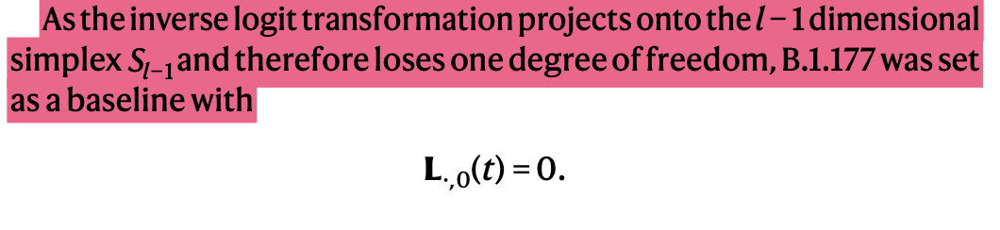

## Overall crux of the paper

In the gerstung lab paper the dynamics of lineages of SARS-CoV-2 that were studied across all LTLA using [[Hierarchical Bayesian model|Growth_Rate_Estimation.Glossary#hierarchical-bayesian-model]]. The whole idea is to have a prior probaility and values for parameters and use the data to get the posterior probahilty and value for the parameters. Incidence, Growth rate and reproductoin number were all calculates by fitting various statistical model with the observed data.

## **Doubts and answers**

1. 384 sample pools belonged to 324 Pangolineages - Does it mean each sample pool was a different lineage?
   > Ans: 324 can include sublineages

2. What does the vector b indicate? It is said as some lineage specific parameter.
3. **HOW?** Relative proportions of lineages or lineage [[Prevalence |Growth_Rate_Estimation.Glossary#incidence-vs-prevalence]] :
$$$
p(t)=\cfrac{x(t)}{\sum x(t)} \propto e^{const+\vec{b}t}\\
$$$
4. What does the h weekly and k-h monthly splines mean? I assume it is the number of knots in the spine.
5. What does the equation  $\delta(t)=\delta(t-1\times 7)\space \forall i \in N$ mean? ($\delta(t)$ is used as factor to account periodic difference in weekly testing pattern). Why is t from 1-6?

> Ans: Don't bother because it is corrections that are brough about to get proper fit

1. In Genomic prevalance what is the offset paramenters **C**?
2. Why l-1 dimension?
3. I don't understand the intuition behind selecting $\alpha_0\space ,\space \alpha_1$  Having $\alpha_0=0.01$ will bring effect only at the hundredth's decimal place of the parameter.
4. I don't quite get the concept of 

### **Important doubt:**

- Why is the derivative of original basis used for claculating the growth rate and not the convoluted function? 

  If the function is not convoluted it intuitively means that infections occured during a former time is being reported at a later time. Finding the derivative of this and fitting the growth rate cannot be correct ,right?

> - But in the Growth rates and Rt section they claim r(t) as delay adjusted by equating it to derivative of f(t). 
> - when $\mu(t)$ is expected number of positive test cases daily and $f(t)$ is a function to capture \# new infections at time t and $\lambda(t)$ is the daily incidence per capita at time t :- $\lambda(t) = log\mu(t) - log(s)$. How will using the convoluted $f^*(t)$ to fit the percapita incidence in each LTLA be right? $f(t)$ doesn't account for the LTLA population.

> Ans: These are the reasons for not reimplementing the paper.

### **Confusion:**

- proper definition of incidence?
  
> Ans: Incidence should take both time and population into consideration

- It was said that: $\lambda(t)=\log(\mu)-\log(s)$ ; But the $\log(s)$ is not considered anywhere thereafter
    1. In the subsection Growth rate and Rt  it is stated as $\log(\mu)=\lambda$
  Why is log(s) not considered.

## Pillar 2 SARS-CoV-2 data

Pubilcly available SARS-CoV-2 test result data  It is the number of positive PCR test cases grouped by specimen date.
315 LTLA were considered and its population data was downloaded from the office of national statistics.

## Data Handling

## Answers for the [[Doubts|meet.2023.08.09#gerstung-lab-paper]]

1. 

## About the model

### Spatiotemporal genomic surveillance model

- [[Hierarchical Bayesian model|Growth_Rate_Estimation.Glossary#hierarchical-bayesian-model]] - fits incidence data in a day and estimate the relative historical prevelance and transmission parameters, I assume r(t). That is deriving posterior values for all the prior parameters using the present data. 
- Following is my derivation of the solution of [[Ordinary differential equation|Growth_Rate_Estimation.Glossary#ordinary-differential-equation]] that takes the form - The rate of change of  viral population: _
$$$
x'(t)=(\vec{b}+r_0(t))*x(t) \equiv \frac{dx}{dt}=(\vec{b}+r_0(t))*x(t)\\
\int \frac{dx}{x(t)}=\int (\vec{b}+r_0(t))dt\\
ln(x(t)) + const = \vec{b}t+const+\int r_0(t)dt\\
x(t)=e^{(\vec{b}t+const+\int r_0(t)dt)}\\
x(t)=e^{(\vec{b}t+const)}v(t) ; v(t) = e^{\int(r_0(t)dt)}\\
$$$
Relative proportions of lineages or lineage [[Prevalence |Growth_Rate_Estimation.Glossary#incidence-vs-prevalence]] :
$$$
p(t)=\cfrac{x(t)}{\sum x(t)} \propto e^{const+\vec{b}t}\\
$$$
Total / [[Cumulative Incidence:|Growth_Rate_Estimation.Glossary#cumulative-incidence]] factorizes into : 
$$$
\mu (t)=v(t) \sum e^{c+\vec{b}t}
$$$
- **t** :- Time in days

- **v(t)**  :- contributes a same factor to each of the lineage since r0 is lineage independent. 

- **p(t)** :- Lineage [[ Prevalence|Growth_Rate_Estimation.Glossary#incidence-vs-prevalence]], Propotion of each of the lineage. It follows a multinomial logistic linear trajectory - because it is for different lineages. The ratio is directly propotional to $e^{c+\vec{b}t}$

- **r0(t)** : scalar time dependent logistic [[Growth rate|Growth_Rate_Estimation.Glossary#epidemic-growth-rate]]. This r0 reflects lineage  independent transmission determinants - I assume this is calculated using overall secondary cases (for each lineages) and specified time interval and not intergeneration time. The lineages will differ only by the transmission intensity which I assume as the [[Reproduction Number|Growth_Rate_Estimation.Glossary#reproduction-number]] at specified time intervals and not intergeneration time 

- **$\mu(t)$** :- Total incidence (incidence of all the lineages together at specified time interval)

## Incidence

- [[Incidence |Growth_Rate_Estimation.Glossary#incidence-vs-prevalence]] is the number of new cases at specified time.
- Let $\mu(t)$ be the expected daily number of positive pillar 2 test
- **s** is the population size in each LTLA(Lower Tier Local Authority)
- $\lambda(t)=log\mu (t)-log(s)$ :- logarithimic daily incidence per capita at time t.
- suppose function $f(t)$ captures the number of new infections at time t. But these new infections are only tested and reported after a delay - **u** that has  distribution **g**.
- The possible overlap is that the infection occured in the previous time bin can be reported in the later time bin, so a convolution is required.
- To include the delay that has a distribution **g**, the function f(t) and the delay are [[Convoluted |Growth_Rate_Estimation.Glossary#convolution-of-functions]].
  $$$
  f*(t) = \int_{0}^\infin g(u)f(t-u)du = (g*f)(t)
  $$$

- time from infection to test equals to the incubation time plus symptoms to test time. The distribution of later is not well defined. But in England the test should be taken within **5days** of the symptoms onset.
- The incubation time that has been utilised has been modified to account the symptom to test time.
  

- To parametrize (to know / fix on the parameters) the changes in logrithmic incidence, h weekly and k-h monthly cubic base [[splines|Growth_Rate_Estimation.Glossary#splines]] $f(t)=(f_1(t),...f_k(t))$are fit to the data. I assume k and h are number of knots in the spline function. The spline is convoluted with the function **g** that denotes the time delay thereby making the spline $f^*(t)=f_{1}^*(t)...f_{k}^*(t)$.
- The convoluted spline is used to fit the $\lambda(t)$ - logarithmic per capita incidence
  $$$
  \lambda(t)=B\times f^*(t)\space ; B \in R^{m\times k} 
$$$
- B :- matrix of coeffictients that is used for fitting the $\lambda(t)$
- m :- for each LTLA
- k :- each spline function.
- The coefficients have a normal [[prior probability|Growth_Rate_Estimation.Glossary#the-prior-probability]] distribution with zero as mean and $\sigma_j=0.2$ as sd for weekly splines and $\sigma_j=1$ for monthly splines. The choice regularize the amplitude of the splines with some instabilities at the end of the time series. Having $\sigma_j=1$  for monthly spline coefficients makes the monthly splines less regularized (high sd means the data - coefficients has high variance.When these coefficients are used then there is less regularization). This less regularization is not a problem because the monthly splines reflects the trend on the scale of several weeks so less noise.
- The original spline function's derivative $f'(t)$ (Rate of change of number of new infections at time t) is used to calculate the growthrate
- [[Important doubt|meet.2023.08.09#important-doubt]]
- $\delta(t)$ - factor accounting for the periodic difference in the testing pattern like $30 \%$ lower specimen taken during the weekends. 
- I think $\mu$ is obtained from the $\lambda(t)$ which was obtained from the convoluted fuction $f^*(t)$ and the $\delta(t)$ factor is multiplied with $\mu(t)$. Probably this gives the correct number of cases per day.
- $\tilde{\mu} = \mu(t) . \delta(t)$
- The total incidence $\tilde{\mu}$ was fit to the observed number of positive tests X by a negative binomial with a dispersion(spread of the distribution - SD or variance or interquartile range) $\omega=10$. The dispersion is an [[Over Dispersion|Growth_Rate_Estimation.Glossary#over-dispersion]] which would buffer the uncorrelated fluctuations.
- $X(t) \sim  NB(\tilde{\mu}(t),\omega)$

## **Growth Rates:**

- Answer for the [[Confusion|meet.2023.08.09#confusion]]:
- [[Epidemic Growth rate|Growth_Rate_Estimation.Glossary#epidemic-growth-rate]] can also be defined as rate of change of log-transformed incidence which is $\lambda$ hence $r(t)=\lambda'(t)$
- which is $r(t)=B\times f'(t)$.

## **Reproductive number  Rt:**

- For reasons of simplicity laplace transform of the [[Generation Time|Growth_Rate_Estimation.Glossary#generation-time]] is not adopted instead,
- Rt values are approximated by multiplying the logarithimic growth rates with a value of $\overline{\tau}_e=5.1d$. This value was found to be reasonable approximation for the convolution.
- $\log(\rho(t)) \approx \frac{d \log(\mu(t))}{dt}*\overline{\tau}_e = r(t)\overline{\tau}_e$

## **Genomic Prevalance:**

- A Logistic linear model for each LTLA is being used to model the dynamics of each lineage prevelance in each LTLA. Because we are in the predicting business, so we have to create a classification model to classify lineages in each LTLA.
- The logistic prevalance is defined as L(T)= logit(P(t)) (more on [[Logit function|Growth_Rate_Estimation.Glossary#logit-function]]. Prevalance is also called as [[The prior probability|Growth_Rate_Estimation.Glossary#the-prior-probability]] [1]).
- The Logistic prevalence  L(t) is modelled using piecewise linear expression : $L(t)=C+b*t_+$ (b- lineage specific growth advantage, C matrix with offset term with dimention $(LTLA\times Lineages)$) which I assume is similar to the features and coefficients combo defining of the independent variables, like the righthand side of the following equation
- $\pi=\beta_0+\beta_1x_1+\beta_2x_2+....+\beta_kx_k$
- $t_+ = t-t_0\space (if\space t>t_0)\space else -\infin\space$ where t0 is the introduction time.
- This time term is introduced to suggest that the lineages can be absent before this time, since the exact time of lineage introduction is not known a 3 week period before the time of observation is chosen. together it is t0.
- $t_0\sim Unif(-14,0)+t^{obs}_0$. I assume that for each lineage the buffer time chosen varies thats why there is a uniform distribution.
- Doubt regarding $L_{.,0}(t)=0$
- Not sure what the offset parameter **C** I think it is a prameter set that is  modelled for each LTLA as an independently distributed [[Multivariate normal randomvariables|Growth_Rate_Estimation.Glossary#multivariate-normal-randomvariables]] with a lineage specific mean **c** and covariance of 10.

> - I assume **C** would be like - say there are 35 LTLA and 6 lineages, Then there might be 35 vectors with l-1 = 5 elements :
> - $LTLA_1=\begin{bmatrix}l1\\l2\\l3\\l4\\l5\\\end{bmatrix}....LTLA_{35}=\begin{bmatrix}l1\\l2\\l3\\l4\\l5\\\end{bmatrix}$
> - Lineage specific mean $C_1=\frac{LTLA_1(l_1)+LTLA_2(l_1)+....LTLA_{35}(l_1)}{35}$
> - [[Covariance|Growth_Rate_Estimation.Glossary#covariance]] of the parameters among the lineages (I assume) for each LTLA is given by  $\begin{bmatrix}var(l_1,l1)&covar(l_1,l_2)&covar(l_1,l_3)&covar(l_1,l_4)&covar(l_1,l_5)\\covar(l_2,l1)&var(l_2,l_2)&covar(l_2,l_3)&covar(l_2,l_4)&covar(l_2,l_5)\\covar(l_3,l1)&covar(l_3,l_2)&var(l_3,l_3)&covar(l_3,l_4)&covar(l_3,l_5)\\.&.&.&.&.\\var(l_5,l1)&covar(l_5,l_2)&covar(l_5,l_3)&covar(l_5,l_4)&var(l_5,l_5)\end{bmatrix}=10\times I_{l-1\times l-1}$
> - I assume this by the dimension of the identity matrix given in the paper

- The lineage specific factor **b** and lineage specific mean off-set **c** are modelled using [[IID|Growth_Rate_Estimation.Glossary#independent-and-identically-distributed-random-variables]] Normal [[prior probability distribution|Growth_Rate_Estimation.Glossary#the-prior-probability]].
-  $b\sim N(0,0.2)$ and $c\sim N(-10,5)$ which means b and c are said to follow a normal distribution with the stated mean and variance

- **MY assumption** :
    1. G(t) is the total number of genomes sequenced in a given LTLA. (n)
    2. I think Y(t) is the $\theta$
    3. p(t) which is the prevalance of each lineages. The prevalance is used as the paramenter of [[Dirichlet-multinomial distribution|Growth_Rate_Estimation.Glossary#dirichlet-multinomial-distribution]].
    4. $Y_{i,.}(t)\sim DirMult(\alpha_0+\alpha_1P_{i,j}(t),G_i(t))$. I think the i,. in $Y_{i,.}(t)$ and in $P_{i,j}(t)$ denotes (i)LTLA, (.)all lineages.
    5. That is for each LTLA the probability distribution of all the lineages are found using this distribution.
    6. Doubts regarding $\alpha_0$ and $\alpha_1$

## **Lineage specific incidence and growth rate:**

- Multiplying total incidence $\mu$ in each of the LTLA with corresponding lineage prevalances for each lineage will give the lineage specific incidence. 
$M_{.,j}(t)=\mu(t).P_{.,j}\space for\space j=0,.....l-1$
- for lineage specific reproductive number Rt

## References

[Vöhringer, H.S., Sanderson, T., Sinnott, M. et al. Genomic reconstruction of the SARS-CoV-2 epidemic in England. Nature 600, 506–511 (2021).](https://doi.org/10.1038/s41586-021-04069-y)
[1]: <https://online.stat.psu.edu/stat509/lesson/17/17.3>