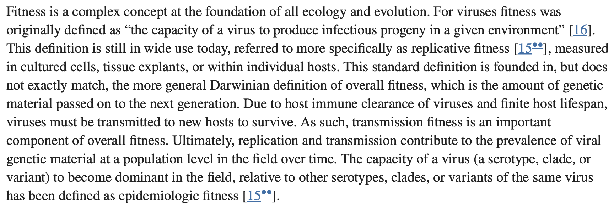
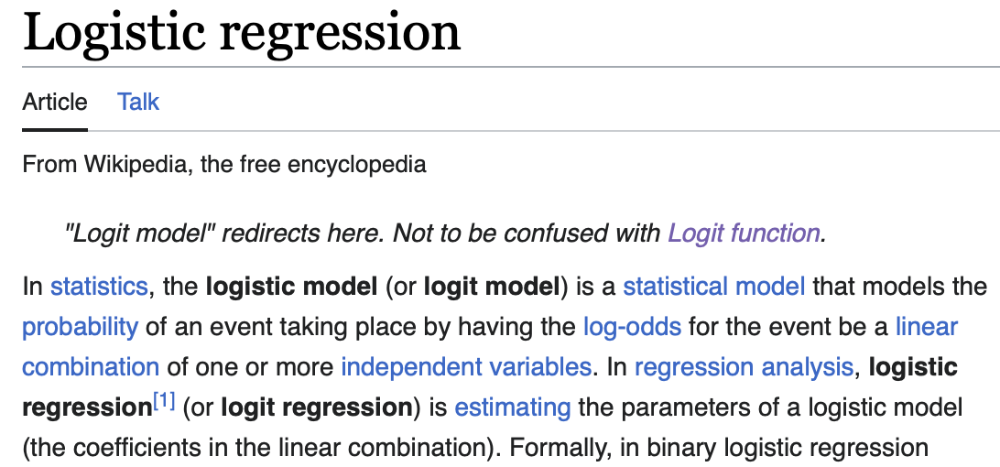
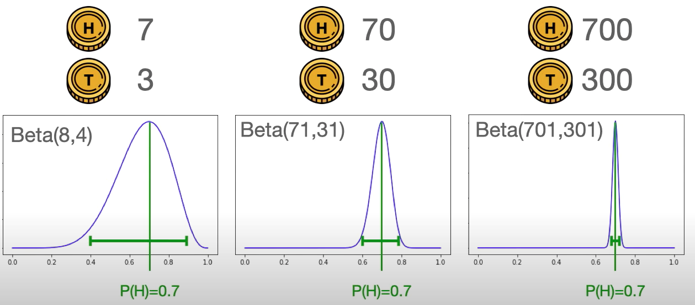
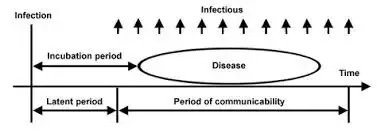

# **Epidemiological Terms**

## **Reproduction Number:**
  
  The number reflects the infectious potential of a disease

### **R<sub>0</sub>(Basic Reproduction Number):**

The expected number of secondary cases generated
by an average infected person(typical primary case) throughout their infectious period in a wholly susceptible population - **_when the population is fully susceptible_**


### **Case Reproductive number or cohort reproductive number:**
The average number of secondary cases arising from a primary case infected at time t. This can be estimated only after time t. So this is mostly observed number.

### **R(Effective Reproduction Number):**

Number of secondary infections generated from a population consisting of both **_naïve/susceptible and exposed/immune individuals_** and therefore will always be less than R0.
The effective reproduction number is also known as instantaneous reproductive number beacuse it is taken at a particular point of time as after the beginning of the endemic/pandemic.

- #### **Backward looking R:**

  R<sub>t</sub> estimated for the cases infected at the time of an intervention like lockdown. This is regarding the primary infection that cased the secondary infections which are currently prevailing when the intervention is introduced (takes pre intervention scenario into account)

- #### **Forward looking R:**
  
  The infections that were prevailing at the time of introduction of intervention were considered as primary infection and the average number of secondary infections caused by these primary infections are taken as forward looking R. This is lower than the backward looking R as the consequence of the intervention.
  
[[Importance of Reproduction number | Growth_Rate_Estimation.SARS_Cov2_notes#importance-of-reproduction-number]].

## **Epidemic Growth rate:**

- Represents the rate at which number of new infections arises.It can be either positive or negative. It is dependent on the reproduction number and timescale between infections $r = (R_0-1)/Ƭ$. If R<sub>0</sub> is greater than 1 then there is an exponential growth rate. When R<sub>0</sub> < 1 the infection cannot be established in the population and dies out.
  [[Relationship between Generation time/ Serial interval, epidemic growth and Reproduction number|Growth_Rate_Estimation.SARS_Cov2_notes#relationship-between-generation-time-serial-interval-epidemic-growth-and-reproduction-number]]
- The instantaneous epidemic growth rate, **r<sub>t</sub>**, defined as the rate of change of the log‐transformed case incidence, has been proposed as a more informative and understandable measure of transmission dynamics. [5]
- Growth rate is esstentially the rate of change of incidence.

## **Seropositives:**

Showing a significant level of serum antibodies, or other immunologic marker in the serum, indicating previous exposure to the infectious agent being tested.

## **Generation Time:**

  The generation time, Ƭ, for an infectious disease is the time between **_infection_** events in an infector-infectee pair of individuals.
  It can be used to derieve the speed of the spread.
  Measuring Generation time is challenging because it is unobserved. Hence is usually replaced with serial time.
  However, ignoring the difference between the serial interval and generation time can lead to biased estimates of R.
  At this early stage the instantaneous r of the exponentially growing epidemic curve, is approximately given by $r = (R_0-1)/Ƭ$
  
## **Serial interval:**

  Serial intervals describe the average time between symptoms of infection in the primary infection to when the person he or she infects develops symptoms.
  It is easier to measure than
   the generation time as symptom onset is easier to identify through contact tracing studies than time of infection acquisition.

## **The doubling time of the epidemic:**

The number of days or time units which leads to a doubling in cases. The doubling time dt in the early stages is therefore: dt = ln(2)/r.
To give a simple example, the doubling times of cases in the UK in the rapid growth phase of the epidemic in March 2020 before 'lock down', was of the order of 3 to 4 days30. Taking a value of 3.5, this gives an r estimate of 0.2 per day.
The doubling time is useful only at the start of epidemic.
When the epidemic is in the decline stage halving time is used. It is the time required for the number of cases to halve and hence how rapidly or slowly the remaining cases will decline to eradication

## **20/80 rule:**

Defines that in many cases 80% of the transmission results from 20% of the infected in any one generation of infection spread.

## **Viral fitness:**

The capacity of a virus (a serotype, clade, or variant) to become dominant in the field, relative to other serotypes, clades, or variants of the same virus has been defined as epidemiologic fitness


[viral_fitness_reference](https://doi.org/10.1016/j.coviro.2012.07.007)

## **Incidence vs Prevalence:**

Prevalence differs from incidence in that prevalence includes all cases, both new and preexisting, in the population at the specified time, whereas incidence is limited to new cases only<br>
Prevelance is calculated as:
$$$
Prevalance = \cfrac{Number\space of \space cases\space in\space the\space population\space at\space one\space time}{total \space population\space at\space that\space timera}
$$$
Incidence is the number of new cases during a specified time period.
Incidence is calculated as:
$$$
Incidence = \cfrac{New\space cases\space during\space a\space specified\space time }{total\space population\space at\space risk\space at\space that\space period\space of\space time\space}
$$$
[13]

## **Cumulative Incidence:**

Cumulative incidence is the proportion of a population at risk that develops the outcome of interest over a specified time period.

## **Virus epidemiological fitness:**

Quantification of epidemiologic fitness is based largely on observational data and examines changes in distribution, prevalence, and composition of viral genotypes over time to infer their relative fitness.

## **CUB(codon usage biases):**

Synonymous codons are codons that encode for the same amino acid. Despite that, synonymous codons are generally used at different frequencies. This phenomenon can be seen in most genes and organisms, and it is called codon usage bias (CUB).

## **Risk model:**

A risk model is a statistical procedure for assigning to an individual a probability of developing a future adverse outcome in a given time period. The assignment is made by combining his or her values for a set of risk-determining covariates with incidence and mortality data and published estimates of the covariates’ effects on the outcome.[2]

## **Ordinary differential equation:**

Differential equation dependent on only a single independent variable. Read More [3]

## **Splines:**

In essence, splines are piecewise polynomials, joined at points called knots. The degree specifies the degree of the polynomials. A polynomial of degree 1 is just a line, so these would be linear splines. Cubic splines have polynomials of degree 3 and so on. The degrees of freedom (df) basically say how many parameters you have to estimate. They have a specific relationship with the number of knots and the degree, which depends on the type of spline.
  >```Note : B splines are splines that have local control - when the control point/knot is moved there is no much differnce in the other parrt of the curve.```

- For B-splines: $df=𝑘+degree$ if you specify the knots or $𝑘=df−degree$ if you specify the degrees of freedom and the degree.
- For natural (restricted) cubic splines: $df=𝑘−1$ if you specify the knots or $𝑘=df+1$ if you specify the degrees of freedom.

- As an example: A cubic spline (degree=3) with 4 (internal) knots will have $df=4+3=7$
degrees of freedom. Or: A cubic spline (degree=3) with 5 degrees of freedom will have $𝑘=5−3=2$ knots.

- The higher the degrees of freedom, the "wigglier" the spline gets because the number of knots is increased.

- The Boundary knots are the outermost two knots, ususally (but not always) placed at the minimum and maximum of 𝑥.
- The other knots are called internal knots and when I talked about the number of knots I was always referring to the internal knots.[4]
- [Introduction to Spline interpolation](https://www.youtube.com/watch?v=5tNApkOJX2M)
- [B-splines](https://www.youtube.com/watch?v=JwN43QAlF50)
- [What is interpolation](https://www.youtube.com/watch?v=gT90n_J1hj8)

## **Cubic Spline:**

- [Cubic spline interpolation Reference Video](https://www.youtube.com/watch?v=pBtqaK0PzrA&t=0s)

## **Convolution of functions:**

- A convolution is an integral that expresses the amount of overlap of one function g as it is shifted over another function  f. It therefore "blends" one function with another.
- Consider function **g** as impulse that acts on a continuous function **f** thereby modifying it a little. The impulse is not continuous or discreete because the impact of preceding impulse overlaps with the succeeding impulse. To account this we use convolution. Following is the convolution intergral.
  $$$
  (f*g)(t) = \int_{0}^\infin f(\tau)g(t-\tau)d\tau
  $$$

- [Best way to understand convolution](https://betterexplained.com/articles/intuitive-convolution/)
- [Convolution explained](https://youtu.be/x3Fdd6V_Hok)

## **Over Dispersion:**

In statistics, overdispersion is the presence of greater variability (statistical dispersion) in a data set than would be expected based on a given statistical model.

## **Logit function:**

- A logit model is a link function that helps us to map the probability that is in the domain [0,1] to realnumber domain $[-\infin,\infin]$.
- Logit function takes the log odds to change this domain of probability. Hence this is also called the log odds function.
- It is the link function that is used to estimate the coefficients of the model. The model with calculated coefficients are fit on the predictor variable distribution using this link function (y variable)  [6],[7],[8]
- My understanding - In the place of a cost function which is used to estimate the parameters in the logistic regression model, a  logit function is being used to turn the probability of the event into logodds based on which the coefficients can be derieved. 

## **Multivariate normal random variables:**

My undersatnding - a vector of random variables which following a random distribution.
The value of the random variables is not known and these random variables denote different property of on statistical unit - one person or one country,etc.
Here for each LTLA(1 statistical unit) a vector with l-1 random variables that denotes parameter for each of the l-1 lineage forms the multivariate normal variables.

## **Independent and identically distributed random variables**

In probability theory and statistics, a collection of random variables is independent and identically distributed if each random variable has the same probability distribution as the others and all are mutually independent

## **The prior probability:**

The Prior probability is the probability assigned to an event before the arrival of some information that makes it necessary to revise the assigned probability. The revision of the prior is carried out using Bayes' rule. The new probability assigned to the event after the revision is called posterior probability or conditional probability P(X=x|Y). A prior probability is the regular/classical probability $\frac{\# of favorable outcomes}{Total \# possible outcomes}$

## **Covariance:**

Covariance is used to measure/observe the trend in variability in two or more random variables. This might sound like correlation. Correlation and covariance differ only in the sense that correlation-coefficient is a normalized verion of covariance and is bound to the interval [-1,1]. Correlation talks about the strength and direction of the relationship between random variables whereas covariance talks only about the direction of the relationship.[9]

## **Beta Distribution:**

- This is a continuous probability distribution that is used when the probability of an event is not known, Consider a biased coin, the probability of heads and probability of tails cannot be 1/2; This biased coin is flipped N times and k occurances of head and N-k occurances of tail is observed. In that case parametres like $\alpha$ and $\beta$ take up the value k and N-k respectively and the random variable in this case is probabilities. The domain is $0\leq x\le 1$ beacuse x denotes the probability. PDF of the function looks like $f(x)=B\times x^{\alpha} (1-x)^{\beta}$. Where B is a normalization term
- This is denoted as $Beta(\alpha+1,\beta+1)$
- The $\alpha$ and $\beta$ control the shape of the curve
- 
- This distribution is often used as priori for probabilities
- Beta distribution is univariate eg - the figure shows the Beta distribution for the probability of heads.
  
  > The $\alpha$ and $\beta$ are not necessarily count of the event. They are just parameters that can be set based on the likeliness of the event or can be set randomly.
  
## **Dirichlet-multinomial distribution:**

- Generalisation of the beta distribution for a vector of probabilities of random variables is Dirichlet distribution that is Dirichlet is multivariate and here we would have multiple parameters.
- Providing the parameter value for the dirichlet gives a distribution from which probabilities can be sampled for each random variable.
- Dirichlet-multinomial distribution is a posterior probability distribution that uses Dirichlet distribution as prior and multinomial likelihood
- we use dirichlet when we just have a vector of of k categories and we use dirichlet-multinomial when we have along with the vector, observed data for n variables that can take any of the k categories.
- The parameter alpha in the case of Dirichlet-multinomial will be summed with an additional term which accounts for multinomial likelihood.
- Important condition $0\le\theta_j\le1$ and $\sum_{j=1}^k\theta_j=1$ since $\theta$ denotes the probability
- PDF for Dirichlet distribution:
  $$$
  \theta\sim Dir(\alpha),\space \alpha_1,\alpha_2....\alpha_k>0\\
  Dir(\alpha)=\prod_{j=1}^k\theta_{j}^{\alpha_j-1}
  $$$
- PDF for Dirichlet-multinomial distribution:
  $$$
  P(\theta|x_{1:n})\propto P(x_{1:n}|\theta)P(\theta)\\
  where \space P(x_{1:n}|\theta)\space is\space multinomial\space likelihood\space and\space P(\theta)\space is\space Dirichlet\space prior\\
  P(\theta|x_{1:n})\propto \prod_{i=1}^n\prod_{j=1}^k\theta_{j}^{I(x_{ij}=1)}\space \prod_{j=1}^k\theta_{j}^{\alpha_j-1}\space\\
  $$$
  > $N_j=\sum_{i=1}^nI(x_{ij}=1)$ is the total number of times the random variables takes up category j in n trials. In a [[Multinomial Distribution|Growth_Rate_Estimation.Glossary#multinomial-distribution]] random variable can take up only one category in each trial
  $$$
  \propto\prod_{j=1}^k\theta_j^{N_j}\prod_{j=1}^k\theta_{j}^{\alpha_j-1}\\
  \propto\prod_{j=1}^k\theta_{j}^{N_j+\alpha_j-1}
  $$$
- Normalising terms are not considerend in the above equations.[10]
- [Refernce for dirichlet](https://www.youtube.com/watch?v=gWgsKyEjclw)
  
## **Multinomial Distribution:**

- In probability theory, the multinomial distribution is a generalization of the binomial distribution. For example, it models the probability of counts for each side of a k-sided dice rolled n times. For n independent trials each of which leads to a success for exactly one of k categories, with each category having a given fixed success probability, the multinomial distribution gives the probability of any particular combination of numbers of successes for the various categories.
- When K = 2 and n=1 it is Bernoulli distribution. When k=2 and n>1 it is Binomial distribution. When k>2 and n=1 it is categorical. When k>2 and n>1 it is multinomial
- The multinomial distribution models the outcome of n experiments, where the outcome of each trial has a categorical distribution, such as rolling a k-sided die n times.

## **Hierarchical Bayesian model:**

- Bayesian hierarchical modelling is a statistical model written in multiple levels (hierarchical form) that estimates the parameters of the posterior distribution using the Bayesian method.[1] The sub-models combine to form the hierarchical model, and Bayes' theorem is used to integrate them with the observed data and account for all the uncertainty that is present. The result of this integration is the posterior distribution, also known as the updated probability estimate, as additional evidence on the prior distribution is acquired.

## **Negative Binomial Distribution:**

 The negative binomial distribution is the probability distribution of the number of successes before the rth failure in a Bernoulli process, with probability p of successes on each trial.

## **Poisson Distribution:**

- A Poisson distribution is a discrete probability distribution, meaning that it gives the probability of a discrete (i.e., countable) outcome.

- The  Poisson distribution is used to predict or explain the number of events occurring within a given interval of time or space. “Events” could be anything from disease cases to customer purchases to meteor strikes. The interval can be any specific amount of time or space, such as 10 days or 5 square inches.

- The Poisson distribution can be used if:

1. Individual events happen at random and independently. That is, the probability of one event doesn’t affect the probability of another event.
2. The mean number of events occurring within a given interval of time or space is known.
3. This number is called λ (lambda), and it is assumed to be constant.
When events follow a Poisson distribution, λ is the only thing you need, to know to calculate the probability of an event occurring a certain number of times. [11]

> Poisson distribution: If $\lambda =mean$ then the pdf of Poisson distribution is $P(X=k|\lambda)=\frac{\lambda^ke^{-\lambda}}{k!}$

[What is poisson distribution and derivation of the formula part1](https://youtu.be/3z-M6sbGIZ0)<br>
[What is poisson distribution and derivation of the formula part2](https://youtu.be/Jkr4FSrNEVY)

> My understanding the Poisson distribution is similar to the binomial distribution in counting the number of success and failures but if we consider the trial in binomial distribution as time interval or space interval, then it is the poisson distribution. The difference is that in binomial distibution in a trial you get only one outcome but when considered as time interval then we can expect multiple outcomes - multiple success or failures. To bring the it to one outcome per unit time, the interval is granulated that is hours ----> minutes-----> seconds so the time interval n willl tend to infinity when we granulate it more and more. So basically poisson is a binomial distribution with n tending to infinity.

## **Probability vs Likelihood:**

Probability is used to find the chance of occurace of a particular situation whereas Likelihood is used to maximise the chances of occurance of a particular situation.
Probability: $P(X=17|\mu=15,\sigma=2)$ So the chances of getting X=17 when the distribution has the given characteristics. The values that X would take can change but the the characteristic of the distribution will remmain. <br>
Likelihood: $Likelihood(\mu=15,\sigma=2|X=17)$. Here the data distribution or the dataset features will be changed to get the maximum likelihood of getting X=17. [12] The likelihood can be said as the probability of getting X=17 when $\mu=15,\sigma=2$ so $L(\mu=15,\sigma=2|X=17)=P(X=17|\mu=15,\sigma=2)$ but it is not same as P(\mu=15,\sigma=2|X=17)

## **Gamma Distribution:**

Gamma distribution is a continuous probability distribution used to model the time that is elapsed before $\alpha$ occurances of an random event. Example calls to the pizza place - after how much time did the pizza place receive 10 calls. Or after how long there are 10000 defects in a production line. The Events are poisson process because the events occur independently and randomly.

Derivation of the Gamma function:

- Let X be elapsed time before $\alpha$<sup>th</sup> occurance of the event. Let $\theta$ be the average time between the occurances. Then the CDF of X is
$$$\\
P(X\le x)=1- P(less\space than\space \alpha\space occurances\space in\space less\space than\space x\space time)
$$$
- The subtrahend is a poisson distribution because it counts the number of occurances in a time unit. 
- The average number of times the event can occur in x time is $\frac{x}{\theta}$. So thats the mean for the poisson distribution. The expression inside the summation is the probability of exactly k occurances in time x.
$$$\\
P(X\le x)=1-\sum_{k=0}^{\alpha-1}\frac{(x/\lambda)^ke^{-x/\lambda}}{k!}, \space x\ge0
$$$
Differentiating and simplifying this would give us the PDF of gamma distribution
$$$\\
f(x)=\frac{x^{\alpha-1}e^{-x/\theta}}{\Gamma(\alpha)\theta^\alpha}, \space x\ge0
$$$
The expected value for waiting time for $\alpha$ occurances is given by $\mu=\alpha\theta$ => $\theta$ is the average time between each occurances, $\alpha$ is the number of occurances so the average waiting time would be the product of both.

The variance of gamma distribution is $\sigma^2=\alpha\theta^2\\$
[Reference video](https://www.youtube.com/watch?v=cpW40zPdAQ8)

## **Bayessian inference:**

- My understanding - Bayessian theorem is used to claculate the posterior probability of a random variable given some observation. To find say P(A|B) we use P(B|A) along with prior probaility of P(A) and P(B). So calculating P(B|A) would be more easy than the otherway around thats why we use the bayesian inference to calculate P(A|B) with the easily calculated P(B|A).
- [Bayes theorem derivation and explanantion](https://youtu.be/XQoLVl31ZfQ)
- [Reference with multiple randome variables](https://math.stackexchange.com/questions/549887/bayes-theorem-with-multiple-random-variables)

## **Coefficient of variation:**
In probability theory and statistics, the coefficient of variation (COV), also known as Normalized Root-Mean-Square Deviation (NRMSD), Percent RMS, and relative standard deviation (RSD), is a **standardized measure of dispersion of a probability distribution or frequency distribution**. It is defined as the ratio of the standard deviation $\sigma$  to the mean $\mu$  (or its absolute value,$|\mu|$), and often expressed as a percentage ("%RSD"). The CV or RSD is widely used in analytical chemistry to express the precision and repeatability of an assay. 
$\\CV=\frac{\sigma}{\mu}$

## **Truncated Normal Distribution:**

In probability and statistics, the truncated normal distribution is the probability distribution derived from that of a normally distributed random variable by bounding the random variable from either below or above.

## **Censoring (Right/Left/Interval):**

+ In statistics, censoring is a condition in which the value of a measurement or observation is only partially known.
+ Left censoring – a data point is below a certain value but it is unknown by how much.
+ Interval censoring – a data point is somewhere on an interval between two values
+ Right censoring – a data point is above a certain value but it is unknown by how much.

## **Moment Generating function:**
In Statistics moments denote the characteristics of the distribution - the first order moment is the mean of the distribution, second order moment is the variance, third and fourth order moments are the skewness and kurtosis of the distribution respectively.
A moment generating function is used to derieve the moment of the distribution. The probability distribution can be determined by its moment generating function.
A Moment generating function of a random variable X is a function $M_X(s)$ and is defined as $M_X(s)=E[e^{sX}]$. Not all Random variables have moment generating function.If Expected value for X $E[exp(tX)]$ exists and is finite for all real numbers t belonging to a close interval $[-h,h]\subseteq R$ with $h\ge0$, then we say X possesses a moment generating function $M_X(t)=E[exp(tX)]$

## **R-squared:**
R-squared is a statistical measure that indicates how much of the variation of a dependent variable is explained by an independent variable in a regression model. Whereas correlation explains the strength of the relationship between an independent and a dependent variable, R-squared explains the extent to which the variance of one variable explains the variance of the second variable. $R^2$ is easy to intepret and easy to calculate too.

## **Exponential Function and e (Euler's number):**

- The Euler's number is used in an exponentially growing function. 
- e is used to describe the 100% continual growth for a end of a period. Consider the Growth for 1 time interval follows a trend $(1+r)$ where r is the rate and the number 1 is the already existing amount(100%). If this calculation is done for a subdivided time intervals (.5+.5) the this would become as $(1+\frac{r}{2})^2$, this would result in a irrational number greater than 2 and less than 3. This generslised with the Euler's number . - If  To find the growth for x=2 periods then we use $e^x$.
- 100 changes of 1 percent rate also gives e:- $(1+.01)^{100}=2.7048$ So we can say $growth=(e^{rate})^{time}$
- $(1+.01)^{100}=e\\(1+.01)^{50}=(1+.01)^{\frac{100}{2}}=e^{\frac{1}{2}}$
- e can match a stair case growth can be modelled with e into a smoother curve.[14]
- [Refernce video regarding the e](https://youtu.be/pg827uDPFqA?feature=shared)
  
## **Latent period:**
The period from the time of infection to the time of becoming infectious is called the pre-infectious period or the latent period.


## **Contact Rate:**
The average number of contacts adequate for disease transmission by an individual per unit time. It can vary by time and it is not a constant qunatity.

## **Expectation maximization algorithm:**
This algorithm is used to find the maximum likelihood parameters of a statistical model. These model apart from the unknown parameters also include known data observations. It is an itreative method EM iteration alternates between performing an expectation (E) step, which creates a function for the expectation of the log-likelihood evaluated using the current estimate for the parameters, and a maximization (M) step, which computes parameters maximizing the expected log-likelihood found on the E step.

## Log transform
A log transform is did when the data distribution is very skewed. Transforming suck data by log would make the distribution clode to normal. [Log transformation](https://youtu.be/LCDiQxB5S84)

## Eurler lotka equation:
1. The Lotka-Euler equation is a mathematical expression used to study pop- ulation dynamics and growth, particularly in the context of demography and ecology. 
2. This equation is predominantly employed in the study of stable age populations, where age-specific birth and death rates remain constant over time.

[1]: <https://sphweb.bumc.bu.edu/otlt/MPH-Modules/PH717-QuantCore/PH717-Module3-Frequency-Association/PH717-Module3-Frequency-Association4.html#:~:text=Cumulative%20Incidence%20Versus%20Incidence%20Rate,-There%20are%20two&text=Cumulative%20incidence%20is%20the%20proportion,%22%20(person%2Dtime)>

[2]: <Whittemore AS. Evaluating health risk models. Stat Med. 2010 Oct 15;29(23):2438-52. doi: 10.1002/sim.3991. PMID: 20623821; PMCID: PMC2990501>

[3]: <https://www.mathsisfun.com/calculus/differential-equations.html>

[4]: <https://stats.stackexchange.com/questions/517375/splines-relationship-of-knots-degree-and-degrees-of-freedom>

[5]: <https://www.ncbi.nlm.nih.gov/pmc/articles/PMC9347870/>

[6]: <https://www.geo.fu-berlin.de/en/v/soga-r/Basics-of-statistics/Logistic-Regression/The-Logit-Function/index.html>

[7]: <https://en.wikipedia.org/wiki/Logit>
[8]: <https://datascience.stackexchange.com/questions/53226/what-is-the-purpose-of-logit-function-at-what-stage-of-model-building-process-t>
[9]: <https://towardsdatascience.com/understanding-the-covariance-matrix-92076554ea44>
[10]: <https://gregorygundersen.com/blog/2020/12/24/dirichlet-multinomial/>
[11]: <https://www.scribbr.com/statistics/poisson-distribution/>
[12]: <https://medium.com/swlh/probability-vs-likelihood-cdac534bf523>
[13]: <https://s4be.cochrane.org/blog/2020/11/06/prevalence-vs-incidence-what-is-the-difference/#:~:text=Two%20types%20of%20incidence%20are,%27%20and%20%27incidence%20rate%27.>
[14]:<https://betterexplained.com/articles/an-intuitive-guide-to-exponential-functions-e/#:~:text=e%20is%20the%20base%20rate,growing%20just%20a%20little%20bit.>