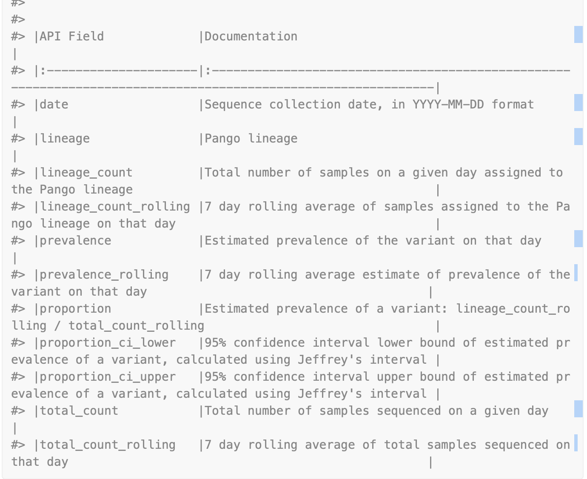

**Description:**

1. outbreak.info is the project that was developed to track the SARS-CoV variants.
2. outbreakinfo is the R package that is used to access the variant data and create visualization to replicate the visualizations in the outbreak.info.
3. This R package is similar to the GISAIDR package in the sense that it gets connected to the GISAID database to do the functionality.
4. Like the login function in the GISAIDR outbreakinfo has authenticateUser() which on execution would open an API to enter the login credentials.
5.
   - The package provides functions for getting the daily prevelance of lineages by location,globaly.
   - It provides functions to get the prevelance of mutations across lineages by location, mutations by lineages.
   - The package also provides functions to retrieve Covid19 data from all the countries. There is a function to also retrieve the [[ISO3 codes|Growth_Rate_Estimation.Glossary#iso3-codes]] of the countries. These cases and death data are not provided by GISAID.

[Fuctions available in outbreakinfo package](https://outbreak-info.github.io/R-outbreak-info/reference/index.html)

## **Functions tried:**
1. **getAdmn1ByCountry("India")**, **getMutationDetails(mutations=c("S:E484K", "S:N501Y"))** : doesnt give any output, tried it with poland also - **no results**.
2. **india = getAllLineagesByLocation(location = "India", other_threshold=0.03, ndays=60)** gives the total count (total number of samples sequenced on the particular day),Lineage_count(Total number of saamples on a given day that is assigned to the lineage),Lineage(name of the lineage), prevalence (Estimated prevalence of the variant on that day - I would call it as incidence, since prevalence of one day should also take into account the prevalence on previous day. So after a day with on case the prevalence cannot be zero in the given time window/population), Prevalence_rolling (7 day [[Rolling Average|Growth_Rate_Estimation.Glossary#rolling-average]] estimate of prevalence of the variant on that day). This function doesnt have an argument to store the lineage of interest. Prevalence of all the lineages in the locaation of interest is retrieved.
3. **getGlobalPrevalence(pangolin_lineage = "B.1.1.7")** This gives the daily prevelance of a lineage globally but the locations are not specified. It estimates the proportion which is the $\frac{lineage\_count\_rolling}{total\_count\_rolling}$ similar values are computed by getPrevalence() function but he difference is that in the former location cannot be specified, in the later location can be specified.
4. getCumulativeBySubdomain Retrieve cumulative prevalence of a PANGO lineage by the immediate administrative level of a location. Location can be specified to this command but if not specified it calculates cumulative prevalence at country level globally. Apart from the location mutations and ndays can also be specified. It returns the name and id of the location, total_count,Lineage_count,cum_total_count (calculated from the first day of detection), cum_lineage_count(calculated from the first day of deection), proportion and the confidance interval of the proportion.

>> 1. **plotAllLineagesByLocation("india")** : plots the prevelance of all the lineages in india for past 180 days(from the current day).
2. **plotPrevalenceOverTime(dataframe from getPrevalence)** plots the daily prevalence of a lineaage in a location or globally

## Overall

>> With functions getGlobalPrevalence(), getPrevalence(), daily prevalence and proportions of the lineages can be obtained. Proportion is obtained through $\frac{lineage\_count\_rolling}{total\_count\_rolling}$.getCumulativeBySubadmin() gives the cumulative prevalence which I think is calculated from the first instance of reporting of the lineage to the last instance of reporting for the lineage. Cumulative lineage proportions are calculated using the $\frac{cum\_lineage\_count}{cum\_total\_count}$
