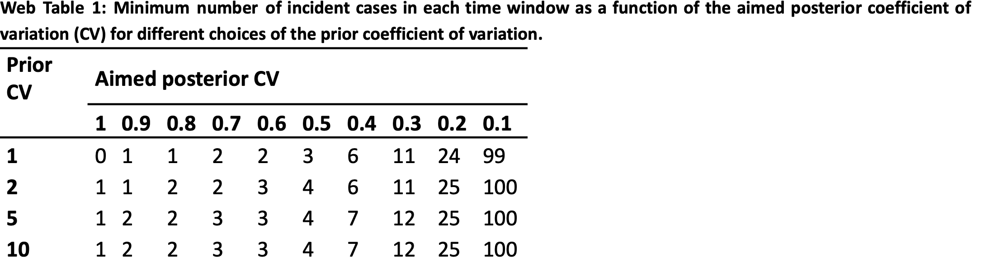
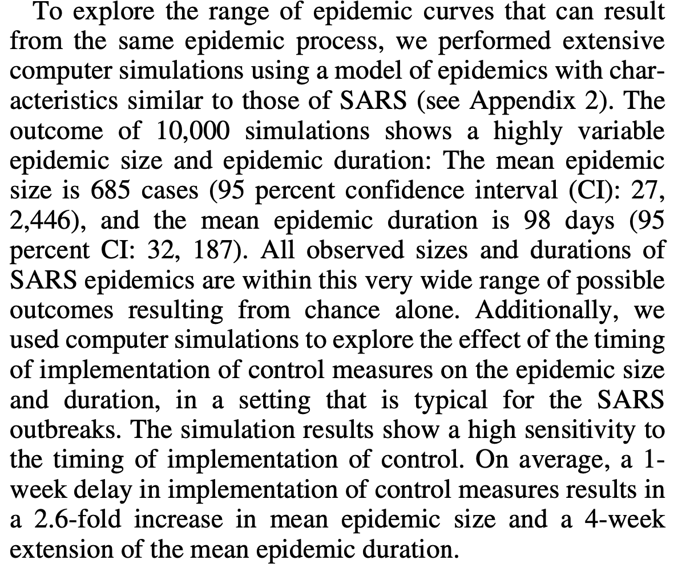

## A New Framework and Software to Estimate Time-Varying Reproduction Numbers During Epidemics - Anne Cori

>EpiEstim R package

### Crux of the paper

+ Motivation of the paper:
  1. To quantify the transmissibility - which can be measured by the reproduction number R, using a ready-to-use tool which uses incidence time series data
  2. Methods based on fitting mechanistic transmission models to incidence data are often difficult to generalize because of the context-specific assumptions often made(e.g., presence/absence of a latency period or size of the population studied).
  3. Though Wallinga and Teunis method is generic it is based on the probabilistic reconstruction of transmission trees and on counting the number of secondary cases per infected individual. $R^c$ is estimated for each time step, if the time step is too small like if the time step is per day  then it would make the curve very swiggly. If the time step is one serial interval then we'll have a smoothened curve - in such situations effectiveness of an intervention cannot be ascertsined through the $R^c$ value. If this curve is smoothened by external means then it would be sensitive to smoothing parameters.
  4. Cohort reproduction number or case reproduction number  $R_t^c$- it is which is affected by intervention methods and so. This can be calculated only retrospectively. Wellinga-Teunis tries to estimate this cohort reproductove number. This method is right [[Censored|Growth_Rate_Estimation.Glossary#censoring-rightleft]]. Since this method estimates the R at particular time t based on the data received after t, at the end of time series the estimate artefactually decrease to zero.
  5. $R_t^c$ can be measured only retrospectively whereas $R_t$ is based on the assumption that the reproductive number is constant. $R_t$ is easier to estimate and there is a sharp change in trend in $R_t$ reflecting the impact of the intervention whereas its not so in $R_t^c$.
  
  > The aim of the study was to develop a generic and robust tool for estimating the time-varying reproduction number, similar in spirit to earlier methods, but implemented with ready-to-use software

+ Intuition of the model
    1. Reproductive number at time t can be found with the incidence at time t and total infectiousness of the infected individuals at time t. But the the whole point is to predict the reproductive number.
    2. A bayesian frame work is used for finding the Reproductive number. The likelihood of incidence given the reproductive number is easier to estimate and fit rather than finding the reproductive number given the incidnece. 
    3. To capture the proper trend in the Reproductive numbers at various time step, a time window is deployed. The length of the window is chosen in such a way that there is not too much statistical noise and there is no excessive smoothning.
    4. In each time step t Reproduction number is calculated on a time window of size $\tau$ endinf at t.
    5. It is not an ideal scenario to know the time of infection, what is usually observed is the symptom onset. So the estimation is approximated using the serial interval and not the generation time. In disease like SARS and smallpox, the infectiousness starts only around the time of symptom onset. In such cases serial interval and generation time are identical.

### Limitations

1. unavailability of data regarding serial interval at the beginning of the pandemic
2. Assumes all the cases after the first set of primary cases are local and not imported.

### Model:
[From Supplementary material](../Reference_papers/Cori_supp.pdf)

+ Assumption: Distribution of infectiousness is independent of calander time. There are no import cases - all the primary and seconday infections belong to incidence time series. The proportion of asymptomatic cases anbd reporting rate are constant. The incubation time is constant.
+ The transmission is modelled through [[Poisson Distribution|Growth_Rate_Estimation.Glossary#poisson-distribution]]
+ Consider someone being infected at time step t-s. The rate at which this person would bring about new infections is said to be equal to $R_tw_s$ where $R_t$ is the [[Instantaneous reproductive number (also known as effective growth number)|Growth_Rate_Estimation.Glossary#reffective-reproduction-number]] which is the average number of secondary cases that each infected individual can cause if the conditions remained as in t. And $w_t$ is said to be the probability distribution of the infectiousness profile after infection - this depends on the biological factors such as pathogen shedding or symptom severity - an individual will be more infectious at time s (time since infection) when $w_s$ is larger.
+ $w_s$ is approximated using serial interval distribution. Because $w_s$ and serial interval distribution would tell the  probability of transmissibality at a particular time.
+ $R_t$ can be estimated by the ratio of the number of new infections generated at time step t, $I_t$, to total infectiousness of infected individual at time t. But we dont know incidence at time t either. So we do all these calculations.
+ The total number of the infected individual at time t is the sum of indidence at all time steps from s to t  $I_{t-s}$multipled with corresponding probabitlity distribution of infectiousness $w_s$ which is more like a weighted sum. This weighted sum is multiplied with $R_t$ to get the average number
+ Therefore $R_t\sum_{s=1}^t{I_{t-s}w_s}$ is the mean of the poisson distribution.
+ The likelihood of $I_t$ is given by poisson distribution 
  $$$\\
  P(I_t|I_0,....I_{t-1},w,R_t)=\frac{(R_t\wedge_t)^{I_t}e^{-R_t\wedge_t}}{I_t!}\\
  \wedge_t=\sum_{s=1}^tI_{t-s}w_s\\  
$$$

 > Poisson distribution: If $\lambda =mean$ then the pdf of Poisson distribution is $P(X=k|\lambda)=\frac{\lambda^ke^{-\lambda}}{k!}$

+ Similarly if we assume that the transmissibility is constant over a time period of $[t-\tau +1,t]$ (that is if we want to estimate $R_10$ and $\tau=3$ then $R_10$ would be estimated on the interval [8,10] days)  and is measured by the Reproductive number $R_{t,\tau}$ then the likelihood of incidence for $I_{t-\tau +1}...I_t$ conditioned on previous incidence is
$$$
  P(I_{t-\tau +1}...I_t|I_0....I_{t-\tau},R_{t,\tau},w)=\prod_{s=t-\tau +1}^t\frac{(R_{t,\tau}\wedge_s)^{I_S}e^{-R_{t,\tau}\wedge_s}}{I_s!}.
$$$

Now we can use the bayessian inference with [[gamma|Growth_Rate_Estimation.Glossary#gamma-distribution]] prior with (a,b) as parameters for $R_{t,\tau}$ to get the posterior joint distribution of $R_{t,\tau}$
$$$\\
P(I_{t-\tau+1},...,I_t,R_{t,\tau}|I_0,...,I_{t-\tau},w)=P(I_{t-\tau+1},...I_t|I_0,..I_{t-\tau},w,R_{t,\tau})P(R_{t,\tau})\\
=(\prod_{s=t-\tau+1}^t\frac{(R_{t,\tau}\wedge_s)^{I_S}e^{-R_{t,\tau}\wedge_s}}{I_s!})(\frac{R_{t,\tau}^{a-1}e^{-\frac{R_{t,\tau}}{b}}}{\Gamma(a)b^a})\\
=R_{t,\tau}^{a+\sum_{s=t-\tau+1}^tI_S-1}e^{-R_{t,\tau}(\sum_{s=t-\tau+1}^t\wedge_s+\frac{1}{b})}\prod_{s=t-\tau+1}^t\frac{\wedge^{I_s}_s}{I_s!}\frac{1}{\Gamma(a)b^a}\\
\propto R_{t,\tau}^{a+\sum_{s=t-\tau+1}^tI_S-1}e^{-R_{t,\tau}(\sum_{s=t-\tau+1}^t\wedge_s+\frac{1}{b})}\prod_{s=t-\tau+1}^t\frac{\wedge^{I_s}_s}{I_s!}
$$$

+ From above, it is shown that the posterior distribution of $R_{t,\tau}$ is a gamma distribution with parameters $(a+\sum_{s=t-\tau+1}^tI_S,\frac{1}{\frac{1}{b}+\sum_{s=t-\tau+1}^t\wedge_s})$ Altering the values of the parameters we can obtain the desired characteristics of the posterior $R_t$.
+ The mean, variance and coefficient of variance of this distribution is 
$$$\\
\mu=\frac{(a+\sum_{s=t-\tau+1}^tI_s)}{(\frac{1}{b}+\sum-{s=t-\tau+1}^t\wedge_s)}\\
\sigma^2=\frac{(a+\sum_{s=t-\tau+1}^tI_s)}{(\frac{1}{b}+\sum-{s=t-\tau+1}^t\wedge_s)^2}\\
CV=\frac{1}{\sqrt{a+\sum_{s=t-\tau+1}^tI_s}}\\
$$$
> **How is cv calculated** : consider parameters be $\alpha$ and $\frac{1}{\beta}$ respectively. Then $$$\\
\mu=\frac{\alpha}{\beta}\\
\sigma^2=\frac{\alpha}{\beta^2}\\
cv=\frac{\sigma}{\mu}=\frac{\sqrt{\frac{\alpha}{\beta^2}}}{\frac{\alpha}{\beta}}=\frac{1}{\alpha}
> $$$

+ Estimate of $R_t$ is dependent on the time window. Choosing a small $\tau$ would give way to detect rapid changes in the transmission but would lead to more noise in the data, while choosing a large $\tau$ would result in more smoothing.
+ The CV of the posterior distribution of $R_{t,\tau}$ allows a way to link the CV and number of incident cases in the time window. A predeterminded CVtreshold would allow to determine the minimium number of incident cases in the time window considered.
  $$$\\
  \sum_{s=t-\tau+1}^tI_s\ge\frac{1}{CV_{treshold}^2}-a
  $$$
  This a can be determined from the prior CV. Say the prior CV is $\frac{1}{\sqrt{a}}$ then if a prior cv of 2 is required 
  $$$\\
  CV_{prior}=\frac{1}{\sqrt{a}}\\
  \sqrt{a}=\frac{1}{CV_{prior}}\\
  a=\frac{1}{CV_{prior}^2}
  $$$

  The following table is derived with prior CV and aimed posterior CV to obtain the incidence in a time window.

+ This table can be used to determine when is it right time to start estimating R based on the required precision.
+ The serial interval is used as an approximation of $w_s$. The distribution of the serial interval is not well characterised at the beginning of the epidemic. A sampling method is described in the paper to account for the uncertainities in the serial interval.

> For instances where there was poor documentation about serial interval, it is assumed to be gamma distributed  while its mean and variance take up values according to [[Truncated Normal Distribution|Growth_Rate_Estimation.Glossary#truncated-normal-distribution]]. The sampled mean and the standard deviation are chosen in such a way that the mean is greater than the standard deviation. This ensures a bell shaped pdf curve with Serial interval as zero when t=0. For each pair $(\mu_{SI},\sigma_{SI})^k$, for each time window $\tau\space n=1000$ R is sampled in its posterior distribution conditional on $(\mu_{SI},\sigma_{SI})^k$. So for each time window we'll have $n\times n_{SI}=1,000,000$ joint posterior distribution of R.

> In cases where the symptom onset denotes the start of infectiousness serial time and generation time are identical.
In such a case the difference between time of symptom onset in the primary and secondary cases is the incubation time.

**Discretization of serial interval distributions:**
The serial interval distribution that is fitten to the events of notable infections in an small environment like household is a continuous distribution. The incidence data that is obtained is always discrete, So a formula to discretize serial interval is proposed in the paper. Web appendix 11, not very intuitive.

## **The $R_0$ Package : A tool box to estimate the reproduction numbers for epidemic outbreaks - Thomas Obadia:**

+ It is more like a review of methods used in the package to estimate the initial growth rate and serial interval distributions.
+ **est.GT** is the fuction that is provided to estimate the serial interval distribution from a sample of observed time intervals between symptom onsets in primary cases and secondary cases by maximum likelihood.
+ Incidence data is provided either as a vector of dates of onset or vector of incidence counts along with initial date or time step.
+ All the methods except the attack rate needs input of epidemic curve, generation time distribution.
+ **estimate.R** is used to estimate R with either of the methods described below.
+ **sensitivity.analysis** computes the the R-squared statistic over a range of time periods chosen by the user. For the estimation of Reproduction number using Exponential growth rate methods and Maximum likelihood it is necessary to do the calculation on the exponential growth of the epidemic.
+ When a best fitting time period is chosen by using the **sensitivity.analysis** function the variability between the Reproductive number estimates given by exponential growth model and maximum likelihood model is minimal.
+ The estimation of R is also affected by the chosen generation time distribution.
+ All the methods tends to be less biased when the aggregation is less that the generation time. Very small aggregation step would result in gaps (0 observations).
+ It has been previously reported that aggregation of time period  equal to mean of generation time is ideal for the estimation
  
### **Methods to estimate Reproduction rate and the associated assumptions:**
+ **Attack Rate:**
  1. It is the percentage of population eventually infected. This is used in the **_SIR model_** and it is linked to the basic reproduction number. 
$$$\\
R_0=-\frac{log(\frac{1-AR}{s_0})}{AR-(1-S_0)}
$$$
$S_0$ initial percentage of suceptible population.
 **Assumptions:**
Homogenous mixing, closed population and no intervention during outbreak
  2. This method can be used only at the end of the epidemic that had no intreventions set up.
  3. Therefore it is used to estimate R in closed settings like epidemic in schools.

+ **Exponential Growth Rate:**
  1. Exponential growth rate at the early phase of an outbreak can be linked to initial reproduction ratio r.
  2. Reproduction number is computed as $R=\frac{1}{M(-r)}$ where M is the [[Moment Generating function|Growth_Rate_Estimation.Glossary#moment-generating-function]] of generation time distribution. This is summarized by Wallinga & Lipsitch.
  + **Condition:** The chosen period should contain exponential growth of the epidemic. This exponential growth period can be chosed using the [[R-squared|Growth_Rate_Estimation.Glossary#r-squared]] statistic
  
+ **Maximum Likelihood estimation(ML):**
  1. Model Proposed by white and Pagano.
  2. **Assumption:** Number of secondary cases caused by primary case is poisson distributed (since it deals with the count of cases per primary case), with expected value R (the average number of secondary cases caused by the primary case.).
  3. Given the observation of incident cases over consecutive time units, generation time distribution w, R is estimated by maximising the log-likelihood  $\\LL(R)=\sum_{t=1}^Tlog(\frac{e^{-\mu_t}\mu_t^{N_t}}{N_t!})\space where\space \mu_t=R\sum_{i=1}^tN_{t-i}w_i$
  4. Generation time shoudl be discretized.
  + **Condition:** The chosen period should contain exponential growth of the epidemic.This exponential growth period can be chosen using the [[R-squared|Growth_Rate_Estimation.Glossary#r-squared]] statistic.

+ **Sequential Bayesian Method(SB):**
  1. Sequential estimation of initial reproduction number.
  2. Relies on the approximation of SIR model where the incidence at time t+1 denoted as N(t+1) is poisson distributed with mean $N(t)e^{\gamma(R-1)}$ where $\frac{1}{\gamma}$ is the average duration of infectious period.

> My interpretation of the mean: there is an average exponential growth in the incidence at a rate of $\gamma(R-1)$ where (R-1) is the average number of secondary cases and the $\gamma$ can be number of primary cases ($\\\frac{sum\space of\space infection\space time\space durations}{number\space of\space infections}=Average\space infectious\space period\\\frac{sum\space of\space infection\space time\space durations}{Average\space infectious\space period}=number\space of\space infections$) Multiplying it with N(t) would give the mean for until time step t.

  3. This Bayesian inference framework is used in this model. The idea is to use the probability distribution of R calculated on the data set $N_0,...N_t$ as prior to calculate the postrior distribution $$$\\
   P(R|N_0,..N_{t+1})=\frac{P(N_{t+1}|R)P(R|N_0,...N_t)}{P(N_0,..N_{t+1})}$$$

  + **Assumption:** Random mixing in the population

+ **Estimation of time dependent reproduction numbers(TD):**
  1. Proposed by Wallinga and Teunis
  2. Reproduction number is computed by averaging over all transmission at same level in a transmission network.
  3. The probability that the case i at time $t_i$ is infected by case j that has time onset $t_j$ is given by $P_{ij}$
  4. $$$\\P_{ij}=\frac{N_iw(t_i-t_j)}{\sum_{i\ne k}N_iw(t_i-t_k)}$$$
  5. The effective reproduction number which is the average number of secondary cases that a primary case can cause is given by the expectation number $R_j=\sum_i p_{ij}$ This is averaged as $R_t=\frac{1}{N_t}\sum_{t_j=t}R_j$ over all cases with same date of onset.
  6. Generation time should be discretized
  7. Imported cases can also be accounted

## Things to note

1. In the situation that the epidemic is not observed from the begining there are possibility of missing few index cases, this might lead to the over-estimation of initial R because of more secondary infections that would have been noted. In case of maximum likelihood method using the assumption of constant reproductive number is used as a corrective measure for this issue.
2. No methods accounts for under reporting. 
3. Delay in reporting would affect the ML and TD methods as it would bias the incidence. It would be possible to correct this if the reporting delay is known.
4. Importation cases could lead to overestimation of reproduction ratio. TD and ML can satisfactorily correct this
5. Combination of reproduction number magnitude, mean generation time duration and aggregation detail is important for a right estimation.

## **Different Epidemic Curves for SARS Reveal similar Impacts of Control Measures - Wallinga and Teunis:**

**Motivation**

1. The epidemic curves of SARS from regions where the disease started at the same time and the interventions were given at the same time. Despite the similarities the epidemic curves were distinct in the temporal patterns in the number of SARS cases.

**Data**

   1. Observed epidemic curves: Number of reported cases by the date of symptom onset. Basically the observed incidence given by days.
   2. Observed Distribution of generation time/ serial time
   
**Estimation of Reproduction numbers - Likelihood based estimation procedure**

1. Since the contact network is usually not known a likelihood method is used to estimate who infected whom from observed incidence data. 
2. A pair of cases are considered while estimating the likelihood to avoid computational complexity.

**Estimation procedure:**
  **Infection Networks:**
  
  1. Considering outbreak of **n** Reported cases with **q** cases being imported, so **n-q** cases has their primary cases among the reported n cases. Each case is indexed with i : $i\isin \{1,..n\}$. This can be represented using a directed graph with nodes as the cases and edges showing the transmissions.
  2. This graph can be represented as a vector **_v_** where the **v(i)** would denote the label primary case that infected the case with label **i**. **v(i)=0** for imported cases.
  3. Entire set of all the infection network is represented as **V**
  4. Each of the **n-q** cases can be possibly caused by any of **n-1** primary cases - since a case cannot infect itself we do a minus 1. Hence we get $(n-q)^{(n-1)}$ different network structures.
  5. Note that the set V includes network structures with cycles and that such structures cannot represent transmission between cases.
  6. Transmission of case j to case i is independent of transmission : case j to case k.
  7. I assume that the labels of cases are mostly the time of infection reported.

  **Likelihood inference for infection networks**
  1. Likelihood that a particular network **v** underlies the the observed epidemic curve **t** (incidence data). 
  2. **Assumption**: The infection occured only among the n cases.
  3. $w(\tau|\theta)$ is the probability density function for generation interval : $\tau$ is the generation interval and $\theta$ are the parametres of the distribution. $w(\tau|\theta)=0$ for $\tau<0$ this ensures that the network with cycles have zero probability associated to it.

  **Likelihood Functions:**

  1. The likelihood of infectious network **v** and Generation time distribution with parameter $\theta$ for given incidence data (epidemic curve t) equals to the probability of the epidemic curve distribution given the infectious network and parameters of distribution.

  > I assume the difference in the time onset of incidence/symptom data would also follow the distribution of the generation time - certain time intervals in the incidence cases can have higher cases in accordance to the generation time.

  $$$\\
L(v,\theta|t)=\prod_{i=1}^{i=n-q}w(t_i-t_{v(i)}|\theta)
  $$$
Calculating the Likelihood for sets of infectious network V. This requires a weight function $c(v|\theta)$ for each of the networks in V. The likelihood over all networks is therefore
$$$\\
L(V,\theta|t)=c\sum_V \prod_{i=1}^{i=n-q}w(t_i-t_{v(i)}|\theta)=c\prod_{i=1}^{i=n-q} \sum_{j=1,j\ne i}^{j=n}w(t_i-t_j|\theta)
  $$$
  for each i in the n-q nodes j primary cases which belongs to N nodes except the self is considered.
Likelihood over all the infectious network which has case k infected by case l (this transmission is explicitely considered)
$$$\\
L(V_{(k,l)},\theta|t)=cw(t_k-t_l|\theta)\prod_{i=1,i\ne k}^{i=n-q} \sum_{j=1,j\ne i}^{j=n}w(t_i-t_j|\theta)
  $$$
> The pobability density function is multiplied on different i (cases) becase $t_i-t_{v(i)}$ are independent pairs while the different primary cases that can infect a case i is mutually exclusive and hence it is added.

**Estimation**
The relative likelihood of case k been infected by case l is given as 
$$$\\
P_{(k,l)}=\frac{L(V_{(k,l)},\theta|t)}{L(V,\theta|t)}=\frac{cw(t_k-t_l|\theta)\prod_{i=1}^{i=n-q} \sum_{j=1,j\ne i}^{j=n}w(t_i-t_j|\theta)}{c\prod_{i=1}^{i=n-q} \sum_{j=1,j\ne i}^{j=n}w(t_i-t_j|\theta)}=\frac{w(t_k-t
_l|\theta)}{\sum_{m=1,m\ne k}^{m=n}w(t_k-t_m|\theta)}
$$$

The distribution of the effective reproduction number for case l is $R_l\sim\sum_{k=1}^{k=n-q}Bernoulli[p_{(k,l)}]$ with expected value
$E(R_l)\sim\sum_{k=1}^{k=n-q}p_{(k,l)}$

**Simultaneous estimation of parameters v and $\theta$:**
When we have the data of transmission of infection between some pairs of cases, it is possible to infer infection network (v) and generational interval parameter ($\theta$) by maximising the likelihood using the [[Expectation maximization algorithm|Growth_Rate_Estimation.Glossary#expectation-maximization-algorithm]]. $\\L(V_{(k,l)},\theta|t)=c(v|\theta)\prod_{(k,l)}w(t_k-t_l|\theta)c\prod_{i=1,i\ne k}^{i=n-q} \sum_{j=1,j\ne i}^{j=n}w(t_i-t_j|\theta)$
(k,l) are all observed cases where k is infected by l.

The effective reproduction number for case j is the sum over all cases it can cause $R_j=\sum_ip_{ij}$

 - It is claimed that the effective reproduction numbers for infectious diseases at a finer temporal resolution under more general assumptions than was previously possible.
  
### **Regarding the performace of the model:**

1. The model allows for a variable effective reproduction number Rt as a function of symptom onset data t, and the model parameters are estimated from observations on the SARS epidemic in Singapore
2. For simulated outbreaks the estimations were close to the actual reproductive number and for smaller outbreaks the estimates were below the actual reproduction number that was used in the simulation model. So taking a smaller epidemic size and a shorter epidemic duration to estimate the R is not recommended. 
3. on average they deviate less that 15% from actual reproduction number.This is also for the scenario of incomplete reporting.
4. Evaluating the effect of time of implementation of control measures on the epidemic size and durations

**Results**

1. This apparent difference in epidemic curves arises because chance effects, such as the occurrence of a rare “super-spread event,” leave a lasting trace on the epidemic curve.
2. The average effective reproduction number etimated by this methos is more precise

## **Improved inference of time-varying reproduction numbers during infectious disease outbreaks - Thomson:**

### Motivation:
Extension of the statistical framework of [[Anne Cori et al.,|growth_rate_estimation.ExtraResources#a-new-framework-and-software-to-estimate-time-varying-reproduction-numbers-during-epidemics---anne-cori]] to estimate $R_t$. The serial interval is derieved from the known pair of primary and secondary cases. The uncertainity in the serial interval is also fully accounted. The method also allows incorporation of imported cases. The methods are implemented in EpiEstim2.2

### Methods:

Two step procedure - Step 1: Estimation of serial interval from observed primary and secondary cases. Step 2: Estimation of $R_t$
jointly from incidence data and from posterior distribution of serial interval that was infered from the first step.

**Estimation of Serial interval:**

1. During a outbreak symptom onset in primary and secondary cases in household and hospitals are recorded as [[Interval Censored|Growth_Rate_Estimation.Glossary#censoring-rightleftinterval]] data. [[Interval censored |Growth_Rate_Estimation.Glossary#censoring-rightleftinterval]] data accounts for the lack of knowledge of precise timing of symptom apprearance.
2. The data was used to perform Bayesian parametric estimation of serial interval distribution using the data augmented Markov chain Montecarlo.

**Estimation of Reproduction number:**

1. The total number of incident cases at timestep t given as $I_t$ is the sum of imported and local cases. $I_t=I_t^{local}+I_t^{imported}$. It is assumed that the local and imported cases can be distinguished by epidemiological investigations. So at each step $I_t^{local}, I_t^{imported}$ are observed. 
2. Following [[Anne Cori et al.,|growth_rate_estimation.ExtraResources#a-new-framework-and-software-to-estimate-time-varying-reproduction-numbers-during-epidemics---anne-cori]] $R_t$ is defined as ratio of number of new locally infected cases to the total infection potential across all the infected individual at time t. The total infectious potential is calculated as:
  $$$\\
  \wedge_t(w_s)=\sum_{s=1}^t(I_{t-s}^{Local}+I_{t-s}^{imported})w_s=\sum_{s=1}^tI_{t-s}w_s$$$
1. The Equations are more similar to the equations in the Cori paper section but there are sampled serial interval distributions which are included to get the posterior probability of reproduction number

### Doubts
1. Attack rate and incidence rate are one and the same?
2. How is $R_t$ the ratio of number of new infections generated at time step t, $I_t$​, to total infectiousness of infected individual at time t?