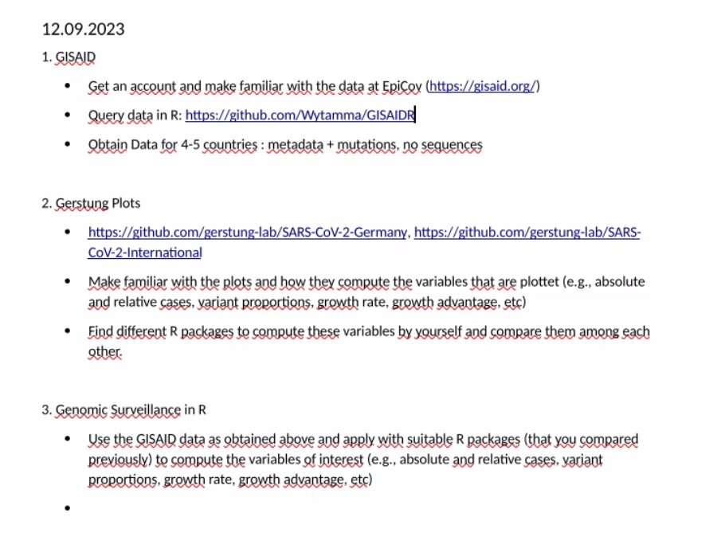

_Edit the [[templates.meet]] note to change this template generated for Dendron Meeting Notes._

## Attendees

<!-- Meeting attendees. If you prefix users with an '@', you can then optionally click Ctrl+Enter to create a note for that user. -->

- Dr. Daniela Börnigen

## Work done so far
[[Tasks|meet.2023.08.17#tasks]]
<!-- What has been done so far -->

## Doubts

<!-- Any doubts to be cleared -->

1. [[Doubts EpiEstim|growth_rate_estimation.Methods to estimate R.R_packages#doubts-epiestim]]
2. [[Doubts|growth_rate_estimation.Methods to estimate R#doubts]]

## Next Step

<!-- What should  I work on till the next meeting-->

## Tasks

<!-- You can add any follow up items here. If they require more detail, you can use `Create Task Note` to create each follow up item as a separate note. -->

- [X] Find the difference in the implementation of WT method in EpiEstim and R_0 package
- [ ] Download data from GSAID using the specified R package
- [ ] Try the EpiEstim and R_0 package on the SARS Cov Data set
- [ ] Code to plot the SARS Cov data, take inspiration from Gerstung lab
- [ ] Try to get R packages to calculate more epidemic values like growth rate advantaage, variant proportions, etc
